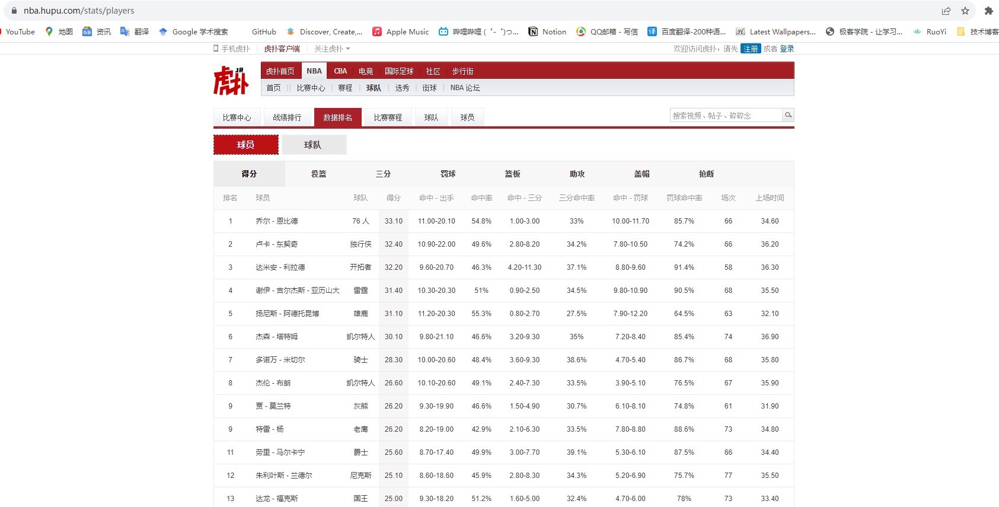

# Python项目实战——获取NBA球员信息

本项目主要是

## 分析网站信息

---

爬虫本质上就是模拟浏览器请求，通过自动化脚本实现请求数据的快速获取。因此网站结构及数据的分析是必要的。

打开虎扑网，查看NBA球员信息：



在上图中，请求网站地址为：[https://nba.hupu.com/stats/players](https://nba.hupu.com/stats/players)

按F12，打开“检查”页面：


数据获取最重要的是从HTML网页源代码中获取数据：我们使用浏览器插件来帮我们快速生成Xpath语法

[Xpath Helper 的安装和使用](http://c.biancheng.net/python_spider/xpath-helper.html)

安装完毕后，在需要匹配数据的页面处，使用快捷键打开助手工具（快捷键：ctrl+shift+x）, 使用示意图如下：


通过简单的Xpath语句正确获取数据，来查看Xpath语句是否正确。

## 编写获取代码

---

Python简单的数据爬虫只需要使用request包即可。输入url及user-agent参数即可模拟浏览器进行数据爬取。

```python
		url = "https://nba.hupu.com/stats/players"
    headers = {'user-Agent' : 'Mozilla/5.0 (Windows NT 10.0; Win64; x64) AppleWebKit/537.36 (KHTML, like Gecko) Chrome/116.0.0.0 Safari/537.36'}
    # 得到的仅仅是网页HTML源代码:文本形式展示出来，不具有结构性
    res = requests.get(url,headers = headers)
```

res返回的仅仅是请求得到的HTML网页源代码，它以txt文本的形式展现出来。实际上获取数据并不困难，困难的是如何从获取的数据进行分析处理，提取出有效的数据。上篇我们简单介绍了Xpath插件的使用。如果需要详细学习请移步[Xpath学习](https://www.runoob.com/xpath/xpath-tutorial.html)

```python
		# 处理结果
    e = etree.HTML(res.text) #变为HTML网页代码，具有结构性
    # 使用XPath获取数据
    nos= e.xpath('//table[@class="players_table"]//tr/td[1]/text()')
    names = e.xpath('//table[@class="players_table"]//tr/td[2]/a/text()')
    teams = e.xpath('//table[@class="players_table"]//tr/td[3]/a/text()')
    scores = e.xpath('//table[@class="players_table"]//tr/td[4]/text()')
```

现在简单遍历，查看数据获取情况：

```python
for no,name,team,score in zip(nos,names,teams,scores):
        print(f"排名：{no} 姓名：{name} 球队：{team} 得分：{score}\n")
```

## 数据保存

---

可以使用 `openpyxl` 库来保存数据到 Excel 中，并设置表头的样式为粗体。以下是增加的代码：

```python
		#数据保存
    # 创建一个新的Excel文件
    wb = openpyxl.Workbook()
    # 选择默认的活动工作表
    ws = wb.active

    # 设置表头样式为粗体
    bold_font = Font(bold=True)
    ws['A1'].font = bold_font
    ws['B1'].font = bold_font
    ws['C1'].font = bold_font
    ws['D1'].font = bold_font

    # 写入表头
    ws['A1'] = '排名'
    ws['B1'] = '姓名'
    ws['C1'] = '球队'
    ws['D1'] = '得分'

    # 写入数据
    for i, (no, name, team, score) in enumerate(zip(nos, names, teams, scores), start=2):
        ws.cell(row=i, column=1).value = no
        ws.cell(row=i, column=2).value = name
        ws.cell(row=i, column=3).value = team
        ws.cell(row=i, column=4).value = score

    # 保存Excel文件
    wb.save('data.xlsx')
```

## 源码记录

---

```python
# 该文件主要是获取NBA球员信息。

import requests
import openpyxl

from lxml import etree
from openpyxl.styles import Font

def get_nba():
    url = "https://nba.hupu.com/stats/players"
    headers = {'user-Agent' : 'Mozilla/5.0 (Windows NT 10.0; Win64; x64) AppleWebKit/537.36 (KHTML, like Gecko) Chrome/116.0.0.0 Safari/537.36'}
    # 得到的仅仅是网页HTML源代码:文本形式展示出来，不具有结构性
    res = requests.get(url,headers = headers)

    # 处理结果
    e = etree.HTML(res.text) #变为HTML网页代码，具有结构性
    # 使用XPath获取数据
    nos= e.xpath('//table[@class="players_table"]//tr/td[1]/text()')
    names = e.xpath('//table[@class="players_table"]//tr/td[2]/a/text()')
    teams = e.xpath('//table[@class="players_table"]//tr/td[3]/a/text()')
    scores = e.xpath('//table[@class="players_table"]//tr/td[4]/text()')

    # 数据遍历
    for no,name,team,score in zip(nos,names,teams,scores):
        print(f"排名：{no} 姓名：{name} 球队：{team} 得分：{score}\n")

    #数据保存
    # 创建一个新的Excel文件
    wb = openpyxl.Workbook()
    # 选择默认的活动工作表
    ws = wb.active

    # 设置表头样式为粗体
    bold_font = Font(bold=True)
    ws['A1'].font = bold_font
    ws['B1'].font = bold_font
    ws['C1'].font = bold_font
    ws['D1'].font = bold_font

    # 写入表头
    ws['A1'] = '排名'
    ws['B1'] = '姓名'
    ws['C1'] = '球队'
    ws['D1'] = '得分'

    # 写入数据
    for i, (no, name, team, score) in enumerate(zip(nos, names, teams, scores), start=2):
        ws.cell(row=i, column=1).value = no
        ws.cell(row=i, column=2).value = name
        ws.cell(row=i, column=3).value = team
        ws.cell(row=i, column=4).value = score

    # 保存Excel文件
    wb.save('data.xlsx')

# 按间距中的绿色按钮以运行脚本。
if __name__ == '__main__':
    get_nba()
```